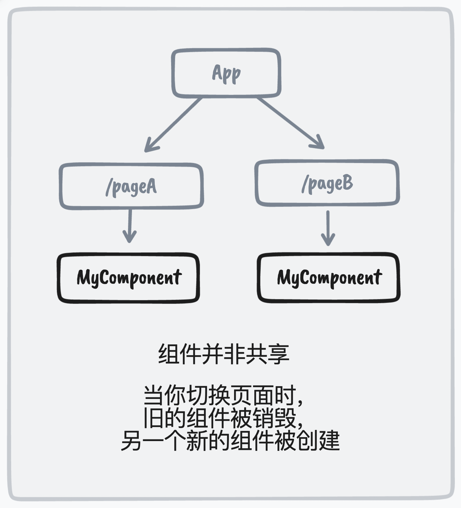
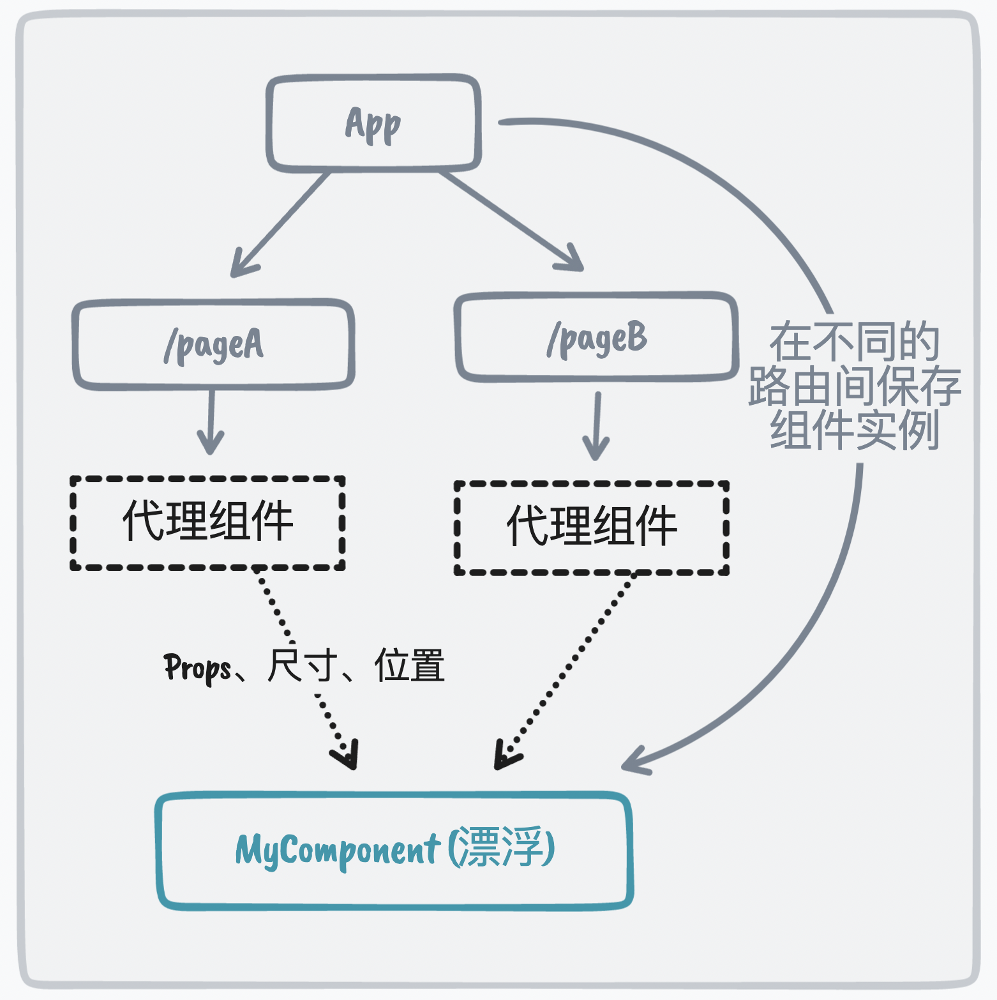
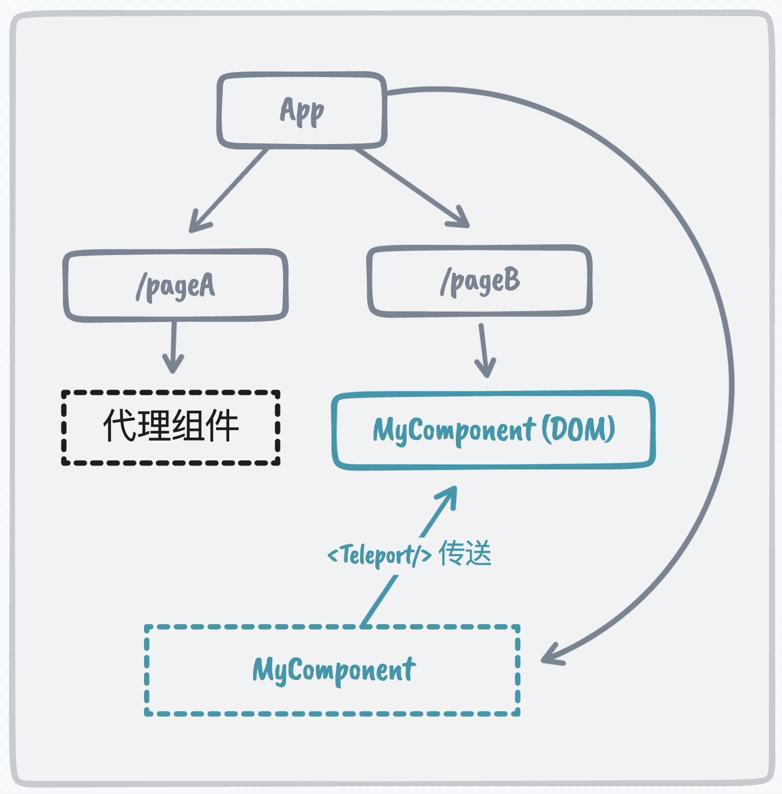

<p align="center">
  
</p>

<p align="center">
  🛰 跨路由组件共享动画
</p>
<p align="center">
  <a href="https://react-starport-example.vercel.app/#/" target="_blank">live demo</a>
</p>


倘若你希望你的组件在不同的路由下(不同页面下)使用，在切换的时候保存组件的状态并且拥有平滑的过渡动画，可以尝试下这个组件。

## 起源

在传统的wen应用中，切换页面，意味着组件的卸载和重新挂载，组件的生命周期会执行，内部的状态也会丢失。

我们在不同的页面使用同一个组件时可能会由于页面布局不同，UI 设计不同导致相同组件的位置、大小、样式、状态等不同，这时我们可能会希望在进行路由跳转时让两个页面使用的相同的组件有一个过渡动画直接将相同的组件流畅的`传递`过去，但是 DOM 结构以树的形式呈现，在不同路由下的组件有着不同的节点，即使**在不同路由下使用相同的组件时也会创建两个组件实例**

<p align="center">
  <br/>
  
  <br/>
</p>

如上图，在 pageA 和 pageB 两个路由下都使用了 ComponentA 组件，那么就会在两个页面创建两次组件实例，当我们从 pageA 路由跳转到 pageB 路由后会不可避免的经历组件的卸载和重新挂载，执行组建的生命周期，而跳转前组件内的状态也会丢失。

尽管我们可以通过 context 或者一些全局状态管理工具(mobx/redux)来存储组件里的一些状态，并且也可以通过[FLIP](https://github.com/googlearchive/flipjs)来模拟不同组件之间的动画，然而，FLIP 只解决了过渡的问题，我们仍然还是会有两个组件实例。在跳转过程中，组件的内部状态将会丢失。这两种实现方式都还是不够`优雅`，因为同一个组件还是会渲染两次，还是要经历组件卸载和重新挂载的生命周期。


## 思路

我们可以参考FLIP的思路，既然我们无法在组件树的不同分支之间共享组件，我们其实上可以将组件提升到根节点上，从而它们独立于路由而存在。

我们页面中的组件，**只是一个代理组件**，用于**接收一些位置信息和一些props**。而真正要渲染的组件，其实是用**绝对定位悬浮在整个App下的**，根据代理组件接收到的位置和样式信息，将悬浮的真正组件通过补间动画的形式移动到对应的位置。

<p align="center">
  <br/>
  
  <br/>
</p>

当补间动画结束之后，我们可以通过createPortal（vue中是teleport）将**真正的组件传送到对应的代理组件中**

<p align="center">
  <br/>
  
  <br/>
</p>


这种方法很像一种“着陆”机制，当跳转到另一路由时，组件将从原页面 “起飞” ，然后变成漂浮的状态，“飞行” 到新的位置，然后再次 “着陆”到指定路由的指定位置。

## 安装

```js
npm i pjy-starport
```
在入口文件引入css
```js
import 'pjy-starport/dist/main.css'
```
## 使用

从 `pjy-starport` 导出并添加 `<Starport>` 组件到根组件 (`App.tsx`)。 所有的组件调用需要在 `<Starport>` 组件内部。

这样做的目的是：一是为了让`FloatContainer`悬浮在整个`App`下，二是让`Starport`包裹住`Router`

```jsx
import { Starport } from 'pjy-starport' 

ReactDOM.createRoot(document.getElementById('root')!).render(
   <Starport>
     <App />
   </Starport>
)
```
现在，准备工作已经完成。

如果我们现在需要让一个图片组件`TheImage`在路由切换时保留状态，具体使用方式如下：

首先，使用`FloatContainer`组件，包裹要渲染的组件，用slot指定要渲染的内容。

> 注意：一定要给`Container`唯一的port字符串

```tsx
import { Starport, FloatContainer } from 'pjy-starport'

function App() {
  return (
    <div className='bg-black w-full text-white'>
      <Starport>
        <Router />
        {imgs.map((img, index) => {
          return (
            <FloatContainer
              key={index}
              slot={() => <TheImage src={img} />}
              port={index + 1 + ''}
            />
          )
        })}
        <FloatContainer slot={() => <Info />} port='13' />
      </Starport>
    </div>
  )
}
```


接着，我们就可以在即将“到达”的页面中使用`FloatProxy`组件来渲染`FloatContainer`组件的`slot`指定的内容了（渲染的时候`slot`外面会多一层`div`），如下。我们可以给`FloatProxy`传入一些`props`，他们会被挂载到`slot`外的`div`上（一般来说可以传入一些样式）。

```tsx
import { FloatProxy } from 'pjy-starport'

const Foo = memo(() => {
  const [mode, setMode] = useState(false)
  return (
      <div flex='~ wrap' justify='center'>
        {['1', '2', '3', '4', '5', '6', '7', '8', '9', '10', '11', '12'].map(
          item => (
            <FloatProxy
              key={item}
              port={item}
              className={mode ? 'w-60 h-50' : 'w-60 h-30'}
              m='5'
              rounded='xl'
              overflow='hidden'
            />
          )
        )}
      </div>
  )
})
```

> 要注意的是：传给`FloatProxy`组件的**port参数**一定是当时指定的唯一字符串，
>
> 即`FloatContainer`组件和`FloatProxy`组件的**port参数**要保持一致


具体案例可以参考：👉[React Starport](https://react-starport-example.vercel.app/#/)

可以看到，我们点击某张图片，触发路由切换，此时组件被移动到另一页面的指定位置，组件状态会保留，并且会有平滑的补间动画。


## License

[MIT](https://github.com/mengqiuleo/react-starport/blob/main/LICENSE) License © 2022 [mengqiuleo](https://github.com/mengqiuleo)